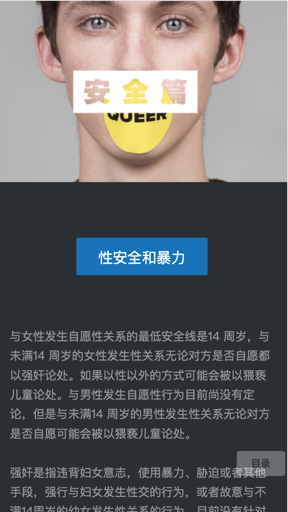
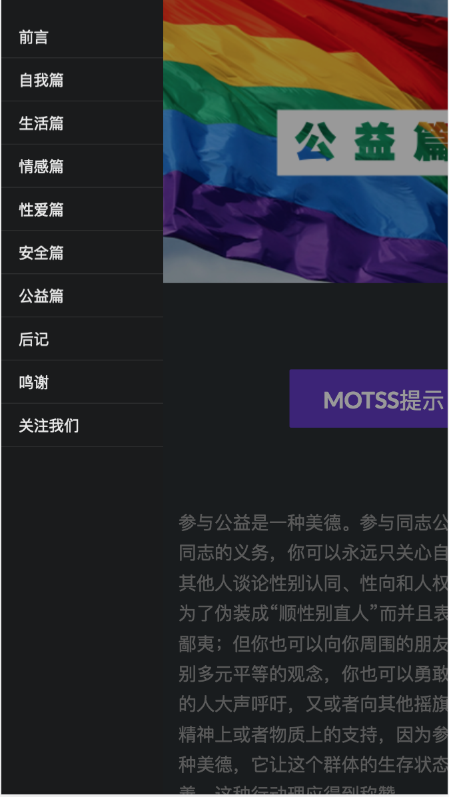

# H5 Guide :books: For Fresh LGBT Students

## Introduction
Motss is LGBT NGO in Hangzhou for students.

This repo is guide are for LGBT fresh university students.
The guide talks about six aspects about LGBT:

* Self-identification
* Life
* Relationship
* Sex
* Safety
* Commonweal activity

Hope LGBT university students have a colorful life. :rainbow: :rainbow: :rainbow:

## Sample
### Safety

### Commonweal Activity

